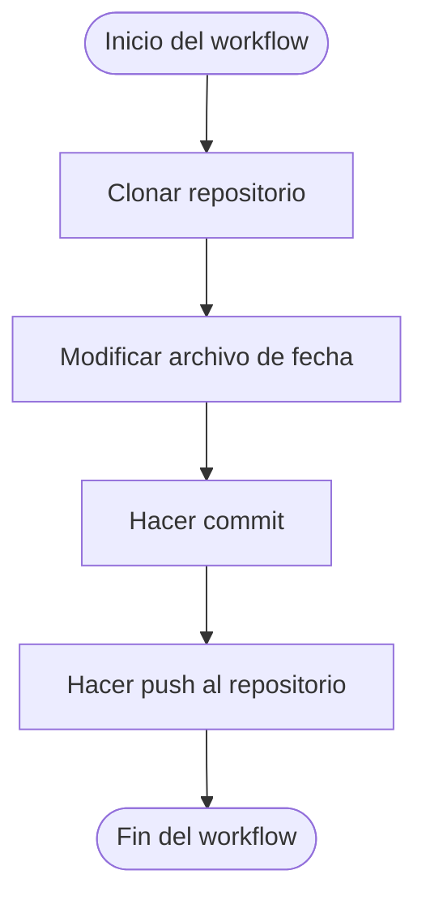

# 🕒 Commit Diario Automático

Este repositorio usa **GitHub Actions** para hacer commits diarios automáticamente y mantener activo tu perfil con contribuciones visibles 🟩.

## 🚀 ¿Cómo funciona?

Este flujo de trabajo (`workflow`) se ejecuta:

- 🔁 Automáticamente **todos los días a las 12:00 UTC**
- ⚙️ Manualmente desde la pestaña **Actions** (si lo deseas)

Cada vez que se ejecuta:
1. Clona el repositorio
2. Actualiza el archivo `ultima_actualizacion.txt` con la fecha y hora actuales
3. Hace un commit automático
4. Sube los cambios a la rama principal

## 🔧 Requisitos

1. Tener un token personal de GitHub (PAT) con permisos de `repo`
2. Guardar ese token en los **Secrets del repositorio** como:

\`\`\`plaintext
Name: PIT
Value: <TU_TOKEN_PERSONAL>
\`\`\`

El archivo de flujo de trabajo se encuentra en:

\`.github/workflows/commit-diario.yml\`

## 📄 Código del Workflow

\`\`\`yaml
name: Commit Diario

on:
  schedule:
    - cron: '0 12 * * *'
  workflow_dispatch:

jobs:
  auto-commit:
    runs-on: ubuntu-latest

    steps:
      - name: Clonar repo
        uses: actions/checkout@v4
        with:
          token: \${{ secrets.PIT }}

      - name: Modificar archivo
        run: |
          echo "Última actualización: \$(date)" > ultima_actualizacion.txt

      - name: Hacer commit y push
        run: |
          git config user.name "andresbot"
          git config user.email "andres@example.com"
          git add .
          git commit -m "Commit automático: \$(date)" || echo "Nada que commitear"
          git push
\`\`\`
## 🔄 Diagrama del Flujo

📝 Nota: Esta automatización es ideal para mantener activo tu perfil, probar GitHub Actions y practicar automatizaciones útiles en tus proyectos personales.

