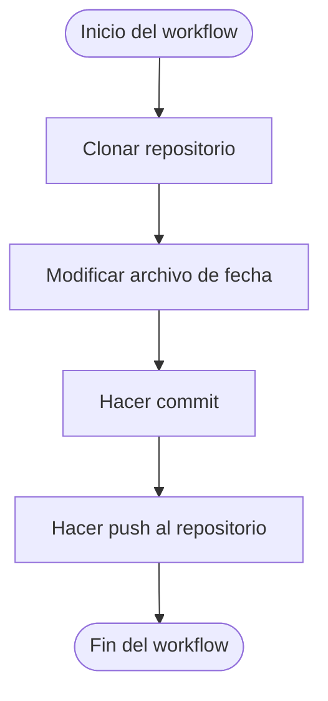

# 🕒 Commit Diario Automático

Este repositorio usa **GitHub Actions** para realizar commits diarios automáticamente y mantener tu perfil activo con contribuciones visibles 🟩.

## 🚀 ¿Cómo funciona?

Este flujo de trabajo (`workflow`) se ejecuta:

- 🔁 **Automáticamente todos los días a las 12:00 UTC**
- ⚙️ **Manual desde la pestaña Actions**

Cada ejecución realiza lo siguiente:
1. Clona el repositorio
2. Actualiza el archivo `ultima_actualizacion.txt` con la fecha y hora actual
3. Hace un commit automático
4. Sube los cambios a la rama principal

## 🔧 Requisitos

1. Crear un **Token Personal de GitHub (PAT)** con permisos de `repo`
2. Ir a **Settings > Secrets and variables > Actions > New repository secret**
3. Guardar el token con el siguiente formato:

```plaintext
Name: PIT
Value: <TU_TOKEN_PERSONAL>
```

El archivo de flujo (`workflow`) está en:

```plaintext
.github/workflows/commit-diario.yml
```

## 📄 Código del Workflow

```yaml
name: Commit Diario

on:
  schedule:
    - cron: '0 12 * * *'
  workflow_dispatch:

jobs:
  auto-commit:
    runs-on: ubuntu-latest

    steps:
      - name: Clonar repo
        uses: actions/checkout@v4
        with:
          token: ${ secrets.PIT }

      - name: Modificar archivo
        run: |
          echo "Última actualización: $(date)" > ultima_actualizacion.txt

      - name: Hacer commit y push
        run: |
          git config user.name "andresbot"
          git config user.email "contrerandres001@gmail.com"
          git add .
          git commit -m "Commit automático: $(date)" || echo "Nada que commitear"
          git push
```

## ✅ Ventajas

- Muestra actividad diaria en tu perfil
- Aprendes a usar GitHub Actions de forma práctica
- Útil para mantener vivos repos con proyectos personales o portafolios

---

## 🔄 Diagrama del Flujo



📝 Nota: Esta automatización es ideal para mantener activo tu perfil, probar GitHub Actions y practicar automatizaciones útiles en tus proyectos personales.
---

📝 *Última edición del README: 2025-07-17 16:08:49*
\`\`\`
